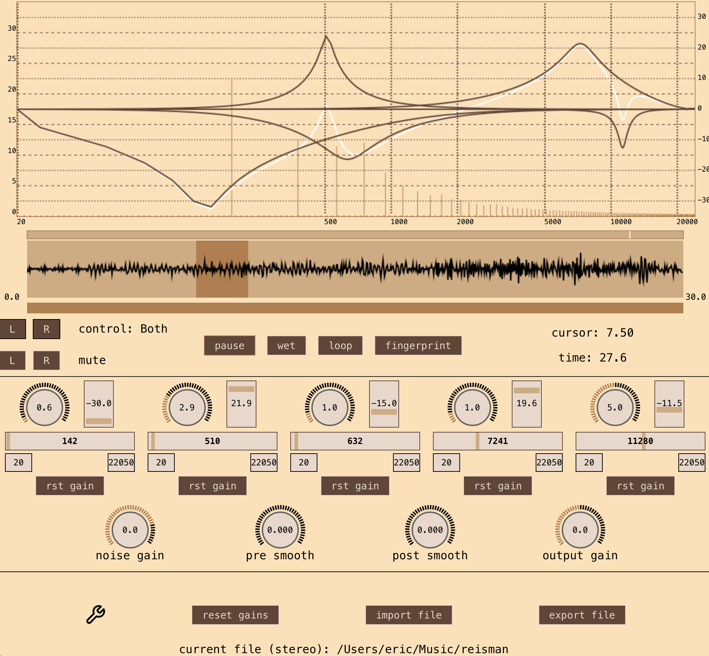

### audio denoiser

The purpose of this project was to use the sliding DFT for audio denoising.
Spectral subtraction is a relatively simple way to remove noise.
Even in theory it has issues and more issues arise when using the STFT with a some hop size.
The STFT hop size only guarntees perfect reconstruction for constant filter banks.
Spectral subtraction suffers from a kind of "under water" sound due to the windowed STFT.
The sliding DFT is an efficient computation of the DFT that cannot be any smoother (search for the paper "Sliding is smoother than jumping")

This project has not been touched for a couple of years.
Most of it is still working. The code is certainly not optimal.
When I started this, I had no idea if it was even possible to smoothly control the audio loop from the frontend. 
After establishing a simple equalizer was possible, I went on to do the rest.
The sliding DFT cannot be too long without causing a delay.
This could be sped up with rayon or some other parallel processing, since the sliding DFT needs to be calculated every single sample

There is enough demonstrated here to show that it is also possible to build a DAW with tauri

